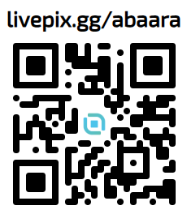

# 🌌 Codex Mutatio Bot

Bot inspirado no I Ching (Livro das Mutações), desenvolvido para consultas oraculares através do WhatsApp e futuramente Telegram.

O projeto utiliza geração de hexagramas através do lançamento virtual de moedas, interpretação simbólica e envio de imagens diretamente pelo bot.

---

# ✨ Funcionalidades

- Consulta oracular baseada no I Ching
- Geração automática de hexagramas
- Hexagrama principal e complementar
- Interpretação completa
- Envio de imagens dos hexagramas
- Fluxo conversacional no WhatsApp
- QR Code de apoio via LivePix
- Estrutura preparada para Telegram

---

# 🧱 Estrutura do Projeto

```txt
src/
 ├── channels/
 │   └── whatsapp/
 │
 ├── services/
 │   └── oracle/
 │
 └── index.ts
```

---

# 🚀 Tecnologias

- Node.js
- TypeScript
- Baileys
- WhatsApp Web API
- qrcode-terminal

---

# 📦 Instalação

```bash
npm install
```

---

# ▶️ Executar WhatsApp

```bash
npm run whatsapp
```

ou:

```bash
npm run dev
```

---

# 📲 Primeira conexão

Ao iniciar o bot, será exibido um QR Code no terminal.

Escaneie utilizando:

WhatsApp → Aparelhos conectados → Conectar aparelho

---

# 🔮 Fluxo da consulta

1. Usuário envia uma pergunta
2. Bot solicita:
   `JOGAR MOEDAS`
3. O sistema gera:
   - Hexagrama principal
   - Hexagrama complementar
4. O bot envia:
   - Imagens
   - Interpretação
   - Encerramento ritualístico

---

# 💖 Apoio ao Projeto

Caso deseje apoiar o projeto:

https://livepix.gg/abaara


---

# ☯ Inspirado em

I Ching — Livro das Mutações.

---

# 📜 Licença

MIT